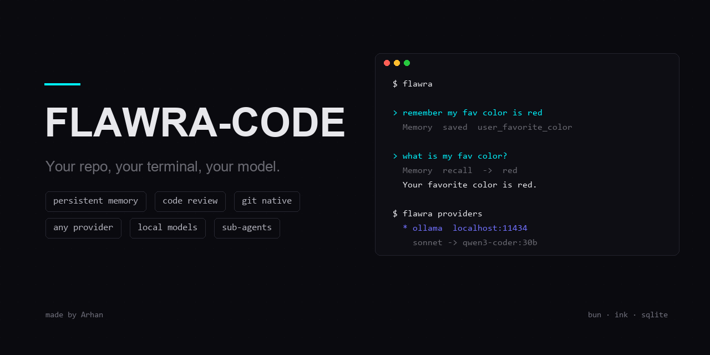
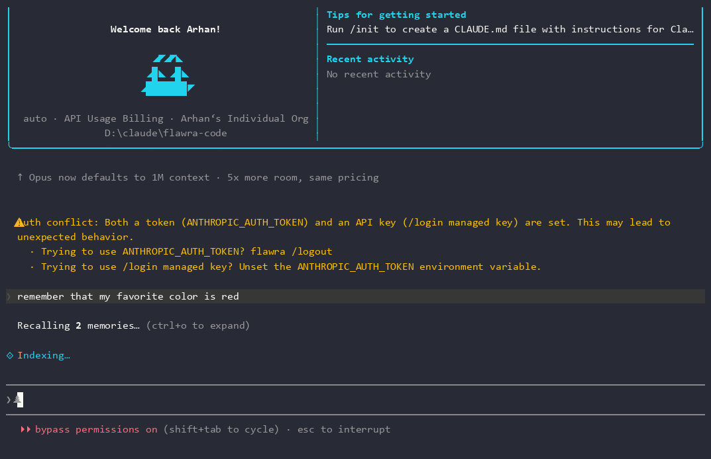

# FLAWRA-CODE

[](https://github.com/Arhan-w/flawra-code)
[](https://bun.sh)
[](./LICENSE)
[](https://github.com/Arhan-w/flawra-code)



> **An agentic coding assistant that lives in your terminal.** Read a codebase, edit files, run commands, search the web, manage git, remember what matters — across sessions, on any model, through any endpoint.

FLAWRA-CODE is a rebuilt, extended terminal coding agent: a full interactive REPL with streaming tool execution, permission gating, sub-agents, skills, MCP support, and persistent memory — plus custom provider routing so you are never locked to one API. Runs an autonomous goal loop, a human-like computer-use driver, and a voice assistant so it can finish tasks end-to-end, click around your desktop, or take commands by voice.

> 🆕 **v2.1.900 — fully rebranded.** The terminal UI, mascot, theme keys, dialog titles, and all `claude` strings have been renamed to `flawra` / `Flawra` / `FLAWRA` across 800+ files. No Claude Code DNA remains in the interface. The Prism mascot now renders with the `flawra` theme color.


## What it does

- **Works in your repo** — reads, edits, and creates files with surgical string replacement; runs shell commands with a permission system and sandbox awareness.
- **Searches like a developer** — glob, ripgrep-backed search, web search, and URL fetching built in.
- **Plans and executes** — plan mode, todo lists, background tasks, and sub-agent delegation for parallel workstreams.
- **Runs unattended** — `flawra harness "<goal>"` drives a multi-turn verify loop until the goal is achieved and proven by the agent's own commands.
- **Drives your desktop** — `flawra_computer` (Windows) takes screenshots, clicks, types, presses keys, scrolls, and lists windows. PowerShell + `user32.dll`, no native modules.
- **Remembers you** — `flawra_memory` persists facts to a local SQLite store (`~/.flawra/memory.db`) and recalls them in future sessions.
- **Reviews before you commit** — `flawra_code_review` scans files or your git working tree for hardcoded secrets, injection patterns, leftover debug code, and perf smells, with a severity-scored report.
- **Speaks git** — `flawra_git` wraps status/diff/branch/commit/push/pull/log/stash in one tool call.
- **Runs any model** — point it at Anthropic, Bedrock, Vertex, Foundry, or any local/self-hosted endpoint that speaks the Messages format.
- **Its own look** — cyan Prism mascot, diamond-pulse spinner, FLAWRA terminal theme. Not a Claude reskin.

## Demo

Watch the full session: **[assets/demo.mp4](assets/demo.mp4)**

*Memory recall in action — the agent stores a fact to SQLite, then retrieves it on the next turn.*



## Install

Requires [Bun](https://bun.sh) ≥ 1.2.

```bash
git clone https://github.com/Arhan-w/flawra-code.git
cd flawra-code
bun install
bun run build
bun link            # exposes the `flawra` command
```

Run it anywhere:

```bash
cd your-project
flawra
```

Non-interactive / pipe mode:

```bash
echo "explain this error: $(some_command 2>&1)" | flawra -p
```

## Harness — autonomous goal loop

Give it an end-state, walk away. The harness runs the agent in print mode, then re-feeds a verify-and-continue checkpoint each turn so the same session keeps going until it actually finishes the goal.

```bash
flawra harness "ship the login page with tests" --max-turns 8
flawra harness "fix every TS error in src/" --max-turns 6 --model sonnet
```

Protocol — the agent must end every turn with exactly one of these on its own final line:

- `HARNESS:DONE` — only when the goal is fully achieved AND verified by a command the agent actually ran.
- `HARNESS:CONTINUE <one-line next step>` — when work remains.

It will not let the agent claim "done" without evidence. Exits 0 on `HARNESS:DONE`, 1 if the turn budget is exhausted.

## Computer use (Windows)

The `flawra_computer` tool drives the real desktop: screenshots, mouse clicks (left/right/double), typing, key combos, scroll, and window enumeration. Drive it like a human — one action, screenshot, decide, repeat.

It is registered automatically on `process.platform === 'win32'`. PowerShell is the only host requirement; no native modules, no admin rights. Screenshots go to `%TEMP%\flawra-computer\screen-<ts>.png` so the agent can read the file back to see what happened.

Hard rules baked into the prompt: never type passwords, never click permission/2FA/"Are you sure" prompts — stop and ask the user instead.

## Custom providers & local models

FLAWRA-CODE works with **any endpoint that speaks the Anthropic Messages format** — Ollama, LM Studio, llama.cpp server, LiteLLM, GitHub Models, or hosted gateways. Configure once in `~/.flawra/providers.json`:

```json
{
  "active": "ollama",
  "providers": {
    "ollama": {
      "label": "Ollama (local)",
      "baseUrl": "http://localhost:11434",
      "apiKey": "ollama",
      "models": {
        "sonnet": "qwen3-coder:30b",
        "haiku": "llama3.2:3b",
        "opus": "qwen3-coder:480b"
      }
    },
    "gateway": {
      "label": "LiteLLM proxy",
      "baseUrl": "http://localhost:4000",
      "apiKeyEnv": "LITELLM_MASTER_KEY",
      "models": { "sonnet": "claude-sonnet-4-5" }
    }
  }
}
```

- `models` maps the built-in aliases (`sonnet`, `opus`, `haiku`, `best`) onto your provider's model IDs — `/model sonnet` then resolves to your local model.
- `apiKeyEnv` reads the key from an environment variable instead of storing it in the file.
- `headers` adds custom request headers (merged into `ANTHROPIC_CUSTOM_HEADERS`).
- Switch providers per-run with `FLAWRA_PROVIDER=gateway flawra`.
- Inspect your config with `flawra providers`.

Environment variables still work for one-off use:

```bash
ANTHROPIC_BASE_URL=http://localhost:11434 ANTHROPIC_AUTH_TOKEN=*** flawra --model qwen3-coder:30b
```

## Config & data location

FLAWRA-CODE owns its own config home so it never collides with any other tool's `~/.claude/` (OAuth tokens, `/login` managed key, etc.):

| Path | What lives there |
|---|---|
| `~/.flawra/` | All FLAWRA-CODE state (override with `FLAWRA_CONFIG_DIR`) |
| `~/.flawra/providers.json` | Custom provider config |
| `~/.flawra/memory.db` | `flawra_memory` SQLite store |
| `~/.flawra/recordings/` | asciicast recordings (when `FLAWRA_RECORD=1`) |
| `%TEMP%\flawra-computer\` | `flawra_computer` screenshots |

## Tools

| Tool | What it does |
|---|---|
| `Bash` | Shell execution with permission rules, sandbox detection, background tasks |
| `Read` / `Write` / `Edit` | File operations with line-ending and encoding preservation |
| `Glob` / `Grep` | Fast file and content search |
| `WebSearch` / `WebFetch` | Live search and page extraction (works through proxies) |
| `Agent` | Spawn sub-agents with isolated context for parallel work |
| `TodoWrite` / `Task*` | Structured task tracking across turns |
| `Skill` | Load reusable procedures from disk |
| `flawra_memory` | Persistent key/value memory (SQLite) across sessions |
| `flawra_code_review` | Security/quality/perf scan with severity scoring |
| `flawra_git` | One-call git: status, diff, commit, push, branch, stash |
| `flawra_computer` | Windows desktop driver: screenshot, click, type, key, scroll (Windows only) |
| `flawra_voice_assistant` | Voice-controlled assistant: capture mic audio, transcribe with Whisper, feed as a user command |
| `flawra_scheduler` | Schedule recurring (cron) or one-time tasks that run shell commands; jobs persist in `~/.flawra/scheduler.json` |
| `MCP*` | Any Model Context Protocol server tool, dynamically discovered |

## Permissions

Nothing destructive happens silently. Every tool call goes through a permission layer: read-only operations run free, edits and commands prompt for approval, and rules in settings (`~/.flawra/settings.json`) let you pre-allow patterns like `Bash(git diff:*)`. Plan mode blocks all writes until you approve the plan.

## Recording demos

Built-in asciicast recorder — no external tools:

```bash
FLAWRA_RECORD=1 flawra        # records to ~/.flawra/recordings/*.cast
agg demo.cast demo.gif        # render with https://github.com/asciinema/agg
```

## Development

```bash
bun run dev          # dev mode with MACRO defines
bun test             # test suite
bun run build        # production bundle → dist/
bun run lint         # biome
```

Architecture: `src/entrypoints/cli.tsx` → `src/main.tsx` (commander) → `src/screens/REPL.tsx` (Ink UI) → `src/QueryEngine.ts` (turn loop, compaction, snapshots) → `src/query.ts` (API streaming + tool execution). Tools live in `src/tools/<Name>/`, each self-contained with schema, prompt, and UI renderer. The harness lives in `src/cli/harness.ts`; the desktop driver in `src/tools/FlawraComputerTool/`.

## Credits

Built by **Arhan**. Architecture informed by open terminal-agent design; providers layer, harness loop, and computer-use driver added for full autonomy and model freedom.

## License

MIT

## Contributing

Thanks for considering a contribution! FLAWRA-CODE is built on Bun and uses Biome for lint/format.

### Setup

```bash
git clone https://github.com/Arhan-w/flawra-code.git
cd flawra-code
bun install
bun run build
```

### Workflow

1. Fork the repo and create a branch from `master`.
2. Make your changes. Follow the existing code style — `bun run format` and `bun run lint` before committing.
3. Add or update tests under `src/__tests__/` for any new tool or behavior.
4. Run `bun test` and `bun run build` locally to verify.
5. Open a PR with a clear description of what changed and why.

### Adding a new tool

Tools live in `src/tools/<ToolName>/<ToolName>.ts`. Each tool needs:

- A `ToolDef` with `name`, `description`, and `schema` (Zod-style).
- An `async run(args)` method returning `{ success, output | error }`.
- A default export via `buildTool(toolDef)`.
- Registration in `src/tools.ts` (import + add to `getAllBaseTools()`).

See `src/tools/FlawraMemoryTool/` as a template.

### Roadmap

| Feature | Status |
|---|---|
| `flawra_scheduler` — cron/one-shot task scheduling | ✅ Done |
| `flawra_voice_assistant` — Whisper transcription + voice commands | ✅ Done |
| `flawra_computer` — Windows desktop driver (click/type/screenshot) | ✅ Done |
| `flawra_memory` — SQLite persistent memory | ✅ Done |
| `flawra_code_review` — security/quality scan with severity scoring | ✅ Done |
| `flawra_git` — one-call git wrapper | ✅ Done |
| `flawra harness "<goal>"` — autonomous goal loop | ✅ Done |
| Custom providers (`~/.flawra/providers.json`) | ✅ Done |
| Full rebrand (claude → flawra, 800+ files) | ✅ Done |
| Web UI integration (Claude Code UI via `ui-integration/`) | ✅ Done |
| GitHub Actions CI | ✅ Done |
| Test suite (`bun test`) | 🟡 Partial |
| Plugin/MCP marketplace | 🔜 Planned |
| Mobile companion app | 🔜 Planned |